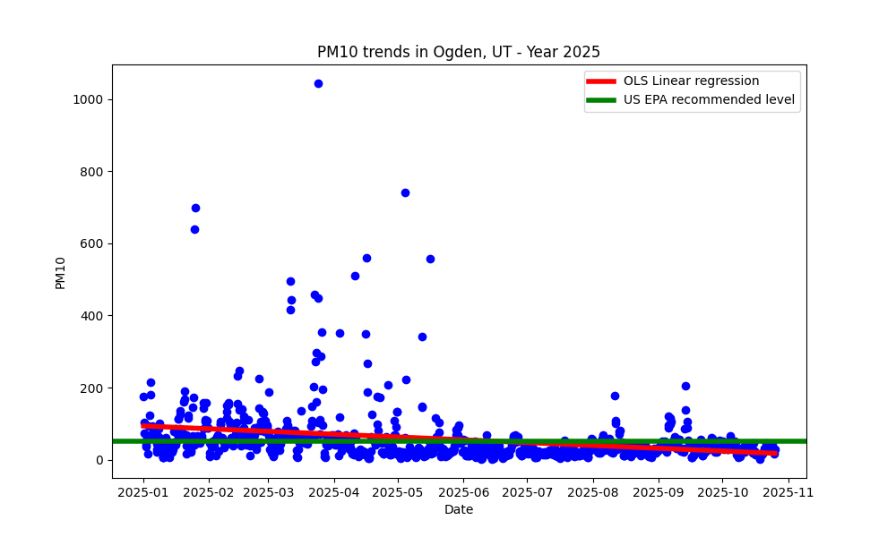
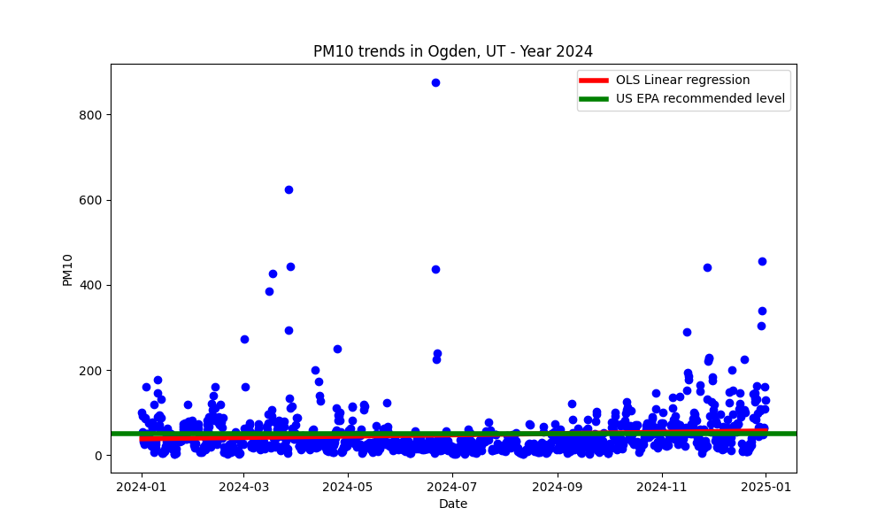

<h1 align = "center">

</h1>
 

I'm a pharmacist 💊 and clinical informatician 📈 living in <b>Utah</b>, USA. 
This tiny project has given me an excuse to play with API calls, GitHub Actions, and automated document updates. 
Today, the sun rose at <b>08:35 AM</b> and sets at <b>06:48 PM</b>. 
As of <b>07:13 AM MST </b> the temperature is <b>52.4°F</b> 👌😄.

 
The air quality in my area is currently <b>fair (PM10: 11.52)</b>. This project automatically collects, stores, and visualizes trends in airborne particulate 
matter changes in my area. Specifically particulate matter smaller than 10 micrometers (PM10).
 
 
So far, this repo has been collecting PM10 air quality data three times per day for the last <b>878</b> days.
During this time, <b>949</b> of <b>2627</b> ( <b>36.1% </b>) of all PM10 points collected
exceeded the recommended US EPA level of 50 PM10.
 
 

  

 

<h3><a href="https://scholar.google.com/citations?hl=en&user=53-926AAAAAJ&view_op=list_works&sortby=pubdate"><b>Find my recent publications on my Google Scholar profile</b></a></h3>
<h3>My Blog Post(s)</h3>
<ul>
  <li><a href="https://clayton-hamilton.medium.com/is-a-pharmacy-residency-right-for-you-9660f6e35fcb"><b>Is pharmacy residency right for you?</b></a> <i>Things to ponder prior to entering the ASHP match process.</i></li>
</ul>
<h3 align="center">📄 Favorite Languages:</h3>

 
 

<h3 align="center">⚒ Tools I use:</h3>

 
 
 
 
 
 
 

<h3 align="center">Find me on</h3>

    

 
<text>Changing random stuff until your program works is 'hacky' and a 'bad coding practice'. But if you do it fast enough, it's called 'Machine Learning' and pays 4x your current salary.  —Steve Maine, Software Engineer</text>

 

  
   
  
   
Last updated on: 2025-02-04 07:13 AM MST

